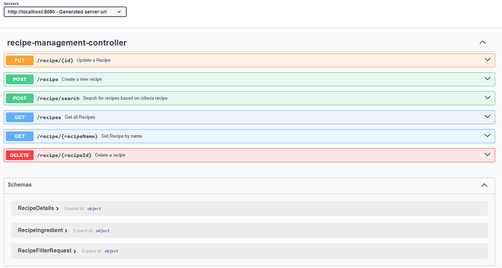
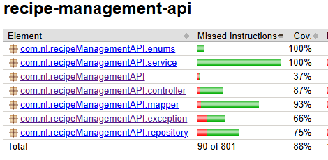

# recipe-management-api
 An api to manage one's favourite recipes
## Description
 This api enables user to manage the recipes by providing various options like create a recipe, update recipe, fetch all recipes,
fetch a recipe by name, update an existing recipe by id, delete a recipe by id and also enables to filter them based on custom combinations like
all the recipes in a particular category, recipes having certain number of servings, recipes containing a specific ingredient and recipe not containing 
a specific ingredient and in combinations.

## Getting started
### Tech stack
* Java 17
* Spring-boot 3.4.3
* Spring-data-jpa for persistence
* map struct for entity to dto transformation and vice versa
* swagger for api documentation
* docker-compose for the execution
* Uses Postgres as the main database
* h2 database in the test scope
* Mockito for Junit
* restAssured for Integration testing
* Jacoco for code coverage analysis

### Dependencies
To run this api,
* docker set up is required.
* Download the docker desktop that suits the operating system  from https://www.docker.com/
* Recommended os versions Windows10 and above

### Installing
Clone the api from the below link
https://github.com/firozKhanPattan/recipe-management-api.git

### Executing the program

* Make sure your docker desktop is running 

* from the root directory to find docker-compose.yml open the command line and run the below command
  docker compose up --build

### Health check
http://localhost:8080/actuator/health

### Documentation

* The api documentation can be in the swagger ui and api requests can be performed.
  http://localhost:8080/swagger-ui/index.html
* 

* The schema information can be found in recipe-management-api-swagger.yml
* For sample requests, please refer RecipeManagement.postman_collection.json
* Please refer to the below screen shot for code coverage reference
* 
## Authors
 Firoz Pattan

